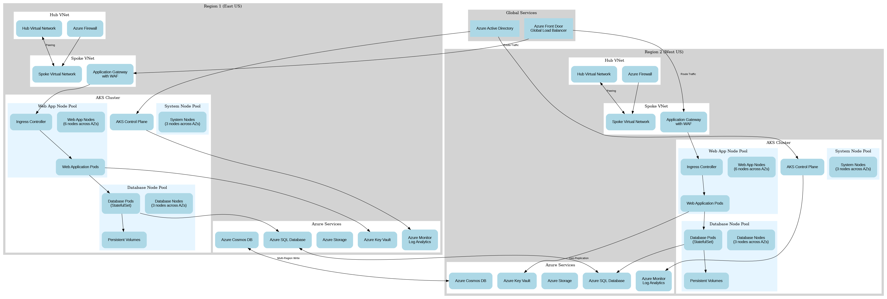

# Azure AKS High Availability Solution Documentation

## Table of Contents

1. [Introduction](#introduction)
2. [Architecture Overview](#architecture-overview)
3. [Components](#components)
4. [Deployment Instructions](#deployment-instructions)
5. [Monitoring and Management](#monitoring-and-management)
6. [Disaster Recovery](#disaster-recovery)
7. [Updating the Application](#updating-the-application)
8. [Cleanup](#cleanup)
9. [References](#references)

## Introduction

This document provides comprehensive documentation for the highly available web application deployment in Azure Kubernetes Service (AKS) with load balancing and database integration. The solution is designed to provide high availability, fault tolerance, and disaster recovery capabilities for mission-critical applications.

The architecture follows Azure best practices and implements the four high availability pillars:
- **Redundancy**: Multiple replicas of components across regions and availability zones
- **Monitoring**: Health probes, logging, and monitoring solutions
- **Recovery**: Automatic failover and recovery mechanisms
- **Checkpointing**: Persistent storage and state management

## Architecture Overview

The solution implements an active-active high availability model with:

- Two identical AKS clusters deployed in paired Azure regions (East US and West US)
- Both clusters actively serving traffic
- Global traffic distribution via Azure Front Door
- Regional failover capabilities
- Hub-spoke network topology
- Zone-redundant resources within each region



## Components

### Infrastructure Components

#### Azure Kubernetes Service (AKS)
- Two AKS clusters (East US and West US)
- Control plane managed by Azure (99.95% SLA with Standard tier)
- Node pools spread across 3 availability zones within each region
- System node pool for Kubernetes system components
- Application node pools for web application workloads
- Database node pool with optimized storage for database workloads

#### Networking
- Hub-Spoke Virtual Network topology in each region
- Virtual Network Peering between Hub and Spoke
- Network Security Groups for traffic control
- Azure Firewall for outbound traffic filtering
- Private Link for secure connections to Azure PaaS services

#### Load Balancing
- Azure Front Door for global load balancing
- Azure Application Gateway with WAF for regional load balancing
- Kubernetes Ingress Controller for in-cluster routing
- Internal Load Balancer for service-to-service communication

#### Database
- Azure SQL Database with geo-replication
- Auto-failover groups for automatic failover
- Zone-redundant storage for high availability within a region

#### Monitoring and Observability
- Azure Monitor for infrastructure monitoring
- Container Insights for Kubernetes monitoring
- Log Analytics for centralized logging
- Application Insights for application performance monitoring

#### Security
- Azure Active Directory integration
- Azure Key Vault for secrets management
- Network Security Groups for network traffic control
- Azure Policy for governance and compliance

### Application Components

#### Web Application Tier
- Deployed as Kubernetes Deployments
- Multiple replicas distributed across availability zones
- Horizontal Pod Autoscaler for automatic scaling
- Readiness and liveness probes for health monitoring
- Anti-affinity rules to distribute pods across nodes

#### Database Tier
- Deployed as Kubernetes StatefulSets
- Persistent storage using Azure Disk with zone redundancy
- Backup and restore capabilities
- Data replication across regions
- Automatic failover configuration

## Deployment Instructions

### Prerequisites

Before deploying the solution, ensure you have the following prerequisites:

1. Azure subscription with sufficient permissions
2. Azure CLI installed and configured
3. Terraform installed (version 1.0 or later)
4. kubectl installed
5. Docker installed (for building and pushing container images)

### Deployment Steps

The deployment process is automated using the provided scripts. Follow these steps to deploy the solution:

1. Clone the repository containing the solution files
2. Navigate to the solution directory
3. Make the deployment scripts executable:
   ```bash
   chmod +x deployment_scripts/*.sh
   ```
4. Run the deployment script:
   ```bash
   ./deployment_scripts/deploy.sh
   ```

The deployment script performs the following actions:
- Logs in to Azure
- Initializes and applies Terraform to create the infrastructure
- Gets AKS credentials for both clusters
- Deploys Kubernetes manifests to both clusters
- Outputs the deployment information

### Verification

After deployment, verify that all components are running correctly:

1. Check the Azure Front Door endpoint provided in the deployment output
2. Run the monitoring script to check the health of all components:
   ```bash
   ./deployment_scripts/monitor.sh
   ```
3. Verify that pods are running in both clusters:
   ```bash
   kubectl get pods -n webapp
   kubectl get pods -n database
   ```

## Monitoring and Management

### Monitoring

The solution includes comprehensive monitoring capabilities:

1. **Azure Monitor**: For infrastructure monitoring
2. **Container Insights**: For Kubernetes monitoring
3. **Log Analytics**: For centralized logging
4. **Application Insights**: For application performance monitoring

To check the health of the deployed solution, use the monitoring script:
```bash
./deployment_scripts/monitor.sh
```

This script provides information about:
- Node status in both clusters
- Pod status in both clusters
- Service status
- Ingress status
- Front Door health
- SQL Database health

### Management

#### Scaling

The solution supports scaling at multiple levels:

1. **Pod Level**: Horizontal Pod Autoscaler based on CPU/memory metrics
2. **Node Level**: Cluster Autoscaler to add/remove nodes based on pod scheduling
3. **Regional Level**: Ability to add additional regional clusters if needed

To manually scale the web application deployment:
```bash
kubectl scale deployment webapp -n webapp --replicas=10
```

#### Access Control

Access to the AKS clusters is managed through Azure Active Directory integration. To get credentials for the clusters:

```bash
# East US cluster
az aks get-credentials --resource-group rg-aks-ha-eastus --name <cluster-name> --admin

# West US cluster
az aks get-credentials --resource-group rg-aks-ha-westus --name <cluster-name> --admin
```

## Disaster Recovery

The solution implements an active-active disaster recovery strategy:

1. **Multiple Regions**: Two identical deployments in different Azure regions
2. **Data Replication**: Database data replicated across regions
3. **Automatic Failover**: Azure Front Door routes traffic away from unhealthy endpoints
4. **Backup and Restore**: Regular backups with cross-region replication

### Failover Scenarios

#### Region Failure

In case of a complete region failure:
1. Azure Front Door automatically routes all traffic to the healthy region
2. SQL Database failover group activates the secondary region
3. No manual intervention required

#### Partial Failure

In case of partial component failure:
1. Health probes detect the failure
2. Traffic is routed to healthy components
3. Failed components are automatically restarted or recreated

## Updating the Application

To update the application components, use the update script:

```bash
./deployment_scripts/update.sh webapp 2.0.0
```

This script:
1. Builds and pushes a new container image with the specified version
2. Updates the deployment in both clusters
3. Performs a rolling update to ensure zero downtime

## Cleanup

To remove all deployed resources, use the cleanup script:

```bash
./deployment_scripts/cleanup.sh
```

This script:
1. Confirms the cleanup operation
2. Uses Terraform to destroy all created infrastructure
3. Removes all resources from both regions

## References

- [Azure Kubernetes Service Documentation](https://learn.microsoft.com/en-us/azure/aks/)
- [Kubernetes Documentation](https://kubernetes.io/docs/home/)
- [Terraform Documentation](https://www.terraform.io/docs)
- [Azure Front Door Documentation](https://learn.microsoft.com/en-us/azure/frontdoor/)
- [Azure Application Gateway Documentation](https://learn.microsoft.com/en-us/azure/application-gateway/)
- [Azure SQL Database Documentation](https://learn.microsoft.com/en-us/azure/azure-sql/)
